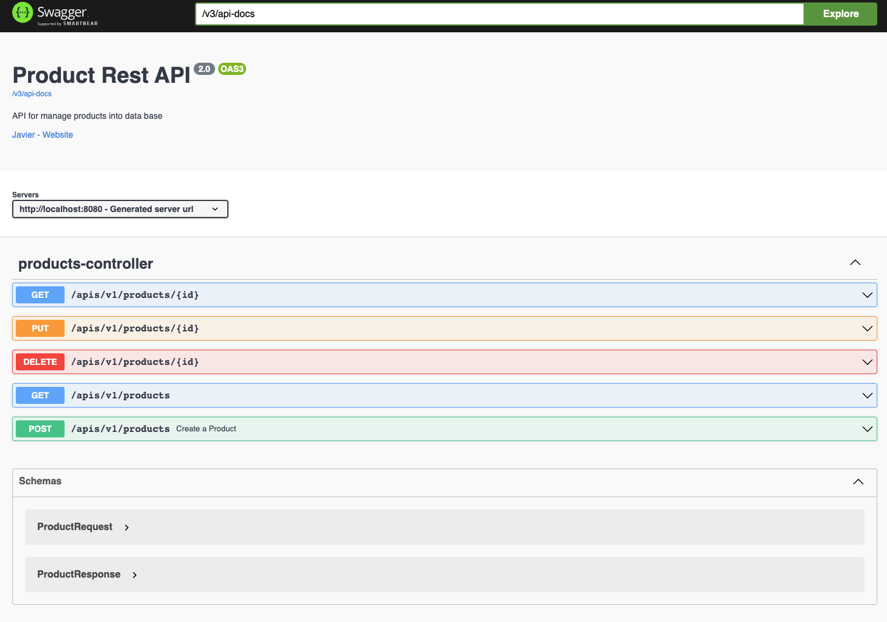

# ms-hexagonal-architecture

This project is a sample for using a hexagonal architecture using Java with SpringBoot trying to use a good practices
like tests, clean code and modules

```xml

<dependency>
    <groupId>io.github.srhojo.java.samples</groupId>
    <artifactId>ms-hexagonal-architecture</artifactId>
    <version>1.0.0</version>
</dependency>
```

## Structure

* application
    * Business application logic
* domain
    * Common DTOs and interfaces to communicate application layer with infrastructure layer
* infrastructure-boot
    * Configuration to start microservice with spring boot
* infrastructure-data-h2
    * Configuration and repositories to connect with database. In this case a memory H2 database.
* infrastructure-res-api
    * Configuration and definition of API rest
* utils
    * Common files and tools to use across the project

## Dependencies

| library                             | version |
|-------------------------------------|---------|
| Java SDK                            | 17      |
| Maven                               | 3.8.x+  |
| Docker                              | 23.0.0  |
| spring-boot-starter-parent          | 3.0.5   |
| springdoc-openapi-starter-webmvc-ui | 2.1.0   |

## Install and Run

The project has configured with Maven, so you need to have installed maven3.8+ and Java17+

To install and pass test execute:

```bash
  mvn clean install
```

To run microservice execute:

```bash
  cd infrastructure-boot && mvn spring-boot:run
```

## Configure MVNW

```bash
   mvn -N wrapper:wrapper
  ./mvnw clean install  

```

## Docker

This project use docker compose to generate docker image and deploy

To build image and deploy:

```bash
  docker-compose up
```

## OpenApi

OpenApi has configured into the project, and you can access with the endpoints

```
  http://localhost:8080/v3/api-docs
  http://localhost:8080/swagger-ui/index.html
```

